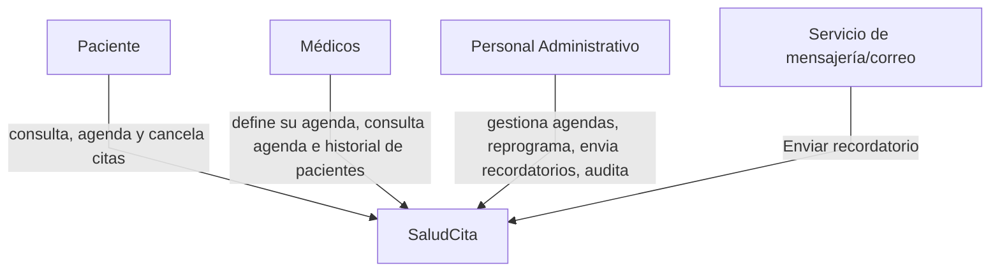

```mermaid
---
config:
  layout: fixed
---
flowchart TB
    n2["Paciente"] L_n2_n1_0@-- consulta, agenda y cancela citas --> n1["SaludCita"]
    n3["Médicos"] L_n3_n1_0@-- define su agenda, consulta agenda e historial de pacientes --> n1
    n4["Personal Administrativo"] L_n4_n1_0@-- gestiona agendas, reprograma, envia recordatorios, audita --> n1
    n5["Servicio de mensajería/correo"] L_n5_n1_0@-- Enviar recordatorio --> n1

    n2@{ shape: proc}
    n1@{ shape: proc}
    n3@{ shape: proc}
    n4@{ shape: proc}
    n5@{ shape: proc}

    L_n2_n1_0@{ curve: linear } 
    L_n3_n1_0@{ curve: linear } 
    L_n4_n1_0@{ curve: linear } 
    L_n5_n1_0@{ curve: linear }
```