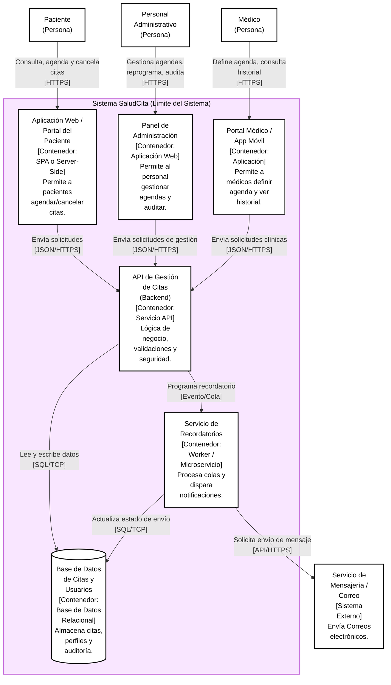

```mermaid
---
config:
  layout: fixed
---
flowchart TB
    %% ============ ACTORES (fuera del límite del sistema) ============
    Paciente["Paciente<br/>(Persona)"]
    Admin["Personal<br/>Administrativo<br/>(Persona)"]
    Medico["Médico<br/>(Persona)"]

    %% ============ LÍMITE DEL SISTEMA ============
    subgraph Sistema["Sistema SaludCita (Límite del Sistema)"]

        WebPac["Aplicación Web /<br/>Portal del<br/>Paciente<br/>[Contenedor:<br/>SPA o Server-<br/>Side]<br/>Permite a<br/>pacientes<br/>agendar/cancelar<br/>citas."]

        PanelAdmin["Panel de<br/>Administración<br/>[Contenedor:<br/>Aplicación Web]<br/>Permite al<br/>personal<br/>gestionar<br/>agendas y<br/>auditar."]

        PortalMed["Portal Médico /<br/>App Móvil<br/>[Contenedor:<br/>Aplicación]<br/>Permite a<br/>médicos definir<br/>agenda y ver<br/>historial."]

        API["API de Gestión<br/>de Citas<br/>(Backend)<br/>[Contenedor:<br/>Servicio API]<br/>Lógica de<br/>negocio,<br/>validaciones y<br/>seguridad."]

        Worker["Servicio de<br/>Recordatorios<br/>[Contenedor:<br/>Worker /<br/>Microservicio]<br/>Procesa colas y<br/>dispara<br/>notificaciones."]

        DB[("Base de Datos<br/>de Citas y<br/>Usuarios<br/>[Contenedor:<br/>Base de Datos<br/>Relacional]<br/>Almacena citas,<br/>perfiles y<br/>auditoría.")]
    end

    %% ============ SISTEMA EXTERNO ============
    Mensajeria["Servicio de<br/>Mensajería /<br/>Correo<br/>[Sistema<br/>Externo]<br/>Envía Correos<br/>electrónicos."]

    %% ============ RELACIONES: ACTORES -> CONTENEDORES ============
    Paciente -->|"Consulta, agenda y cancela<br/>citas<br/>[HTTPS]"| WebPac
    Admin -->|"Gestiona agendas,<br/>reprograma, audita<br/>[HTTPS]"| PanelAdmin
    Medico -->|"Define agenda, consulta<br/>historial<br/>[HTTPS]"| PortalMed

    %% ============ RELACIONES: CONTENEDORES -> API ============
    WebPac -->|"Envía solicitudes<br/>[JSON/HTTPS]"| API
    PanelAdmin -->|"Envía solicitudes de gestión<br/>[JSON/HTTPS]"| API
    PortalMed -->|"Envía solicitudes clínicas<br/>[JSON/HTTPS]"| API

    %% ============ RELACIONES DEL API ============
    API -->|"Programa recordatorio<br/>[Evento/Cola]"| Worker
    API -->|"Lee y escribe datos<br/>[SQL/TCP]"| DB

    %% ============ RELACIONES DEL WORKER ============
    Worker -->|"Actualiza estado de envío<br/>[SQL/TCP]"| DB
    Worker -->|"Solicita envío de mensaje<br/>[API/HTTPS]"| Mensajeria

    %% ============ ESTILOS (blanco y negro, como la imagen) ============
    classDef actor fill:#ffffff,stroke:#000000,stroke-width:2px,color:#000000
    classDef container fill:#ffffff,stroke:#000000,stroke-width:2px,color:#000000
    classDef database fill:#ffffff,stroke:#000000,stroke-width:2px,color:#000000
    classDef external fill:#ffffff,stroke:#000000,stroke-width:2px,color:#000000
    classDef boundary fill:#f9e6ff,stroke:#c266d9,stroke-width:2px,color:#000000

    class Paciente,Admin,Medico actor
    class WebPac,PanelAdmin,PortalMed,API,Worker container
    class DB database
    class Mensajeria external
    class Sistema boundary
```
---