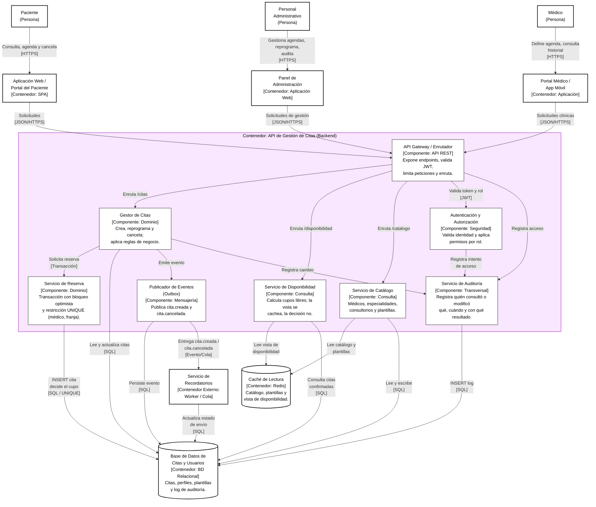

```mermaid
flowchart TB
    %% ================= ACTORES =================
    Paciente["Paciente<br/>(Persona)"]
    Admin["Personal<br/>Administrativo<br/>(Persona)"]
    Medico["Médico<br/>(Persona)"]

    %% ================= CONTENEDORES CLIENTE =================
    WebPac["Aplicación Web /<br/>Portal del Paciente<br/>[Contenedor: SPA]"]
    PanelAdmin["Panel de<br/>Administración<br/>[Contenedor: Aplicación Web]"]
    PortalMed["Portal Médico /<br/>App Móvil<br/>[Contenedor: Aplicación]"]

    %% ================= LÍMITE DEL CONTENEDOR (NIVEL 3) =================
    subgraph API["Contenedor: API de Gestión de Citas (Backend)"]

        Gateway["API Gateway / Enrutador<br/>[Componente: API REST]<br/>Expone endpoints, valida JWT,<br/>limita peticiones y enruta."]

        Citas["Gestor de Citas<br/>[Componente: Dominio]<br/>Crea, reprograma y cancela;<br/>aplica reglas de negocio."]

        Disp["Servicio de Disponibilidad<br/>[Componente: Consulta]<br/>Calcula cupos libres; la vista se<br/>cachea, la decisión no."]

        Catalogo["Servicio de Catálogo<br/>[Componente: Consulta]<br/>Médicos, especialidades,<br/>consultorios y plantillas."]

        Auth["Autenticación y Autorización<br/>[Componente: Seguridad]<br/>Valida identidad y aplica<br/>permisos por rol."]

        Reserva["Servicio de Reserva<br/>[Componente: Dominio]<br/>Transacción con bloqueo optimista<br/>y restricción UNIQUE (médico, franja)."]

        Outbox["Publicador de Eventos<br/>(Outbox)<br/>[Componente: Mensajería]<br/>Publica cita.creada y<br/>cita.cancelada."]

        Auditoria["Servicio de Auditoría<br/>[Componente: Transversal]<br/>Registra quién consultó o modificó<br/>qué, cuándo y con qué resultado."]
    end

    %% ================= ALMACENES Y EXTERNOS =================
    DB[("Base de Datos de<br/>Citas y Usuarios<br/>[Contenedor: BD Relacional]<br/>Citas, perfiles, plantillas<br/>y log de auditoría.")]

    Cache[("Caché de Lectura<br/>[Contenedor: Redis]<br/>Catálogo, plantillas y<br/>vista de disponibilidad.")]

    Worker["Servicio de<br/>Recordatorios<br/>[Contenedor Externo:<br/>Worker / Cola]"]

    %% ================= ACTORES -> CONTENEDORES CLIENTE =================
    Paciente -->|"Consulta, agenda y cancela<br/>[HTTPS]"| WebPac
    Admin -->|"Gestiona agendas, reprograma,<br/>audita<br/>[HTTPS]"| PanelAdmin
    Medico -->|"Define agenda, consulta<br/>historial<br/>[HTTPS]"| PortalMed

    %% ================= CLIENTES -> API =================
    WebPac -->|"Solicitudes<br/>[JSON/HTTPS]"| Gateway
    PanelAdmin -->|"Solicitudes de gestión<br/>[JSON/HTTPS]"| Gateway
    PortalMed -->|"Solicitudes clínicas<br/>[JSON/HTTPS]"| Gateway

    %% ================= ENRUTAMIENTO =================
    Gateway -->|"Enruta /citas"| Citas
    Gateway -->|"Enruta /disponibilidad"| Disp
    Gateway -->|"Enruta /catalogo"| Catalogo
    Gateway -->|"Valida token y rol<br/>[JWT]"| Auth

    %% ================= DOMINIO DE CITAS =================
    Citas -->|"Solicita reserva<br/>[Transacción]"| Reserva
    Reserva -->|"INSERT cita<br/>decide el cupo<br/>[SQL / UNIQUE]"| DB
    Citas -->|"Lee y actualiza citas<br/>[SQL]"| DB
    Citas -->|"Emite evento"| Outbox
    Citas -->|"Registra cambio"| Auditoria

    %% ================= CONSULTAS Y CACHÉ =================
    Disp -->|"Lee vista de<br/>disponibilidad"| Cache
    Disp -->|"Consulta citas<br/>confirmadas<br/>[SQL]"| DB
    Catalogo -->|"Lee catálogo y<br/>plantillas"| Cache
    Catalogo -->|"Lee y escribe<br/>[SQL]"| DB

    %% ================= AUDITORÍA Y EVENTOS =================
    Auth -->|"Registra intento<br/>de acceso"| Auditoria
    Gateway -->|"Registra acceso"| Auditoria
    Auditoria -->|"INSERT log<br/>[SQL]"| DB
    Outbox -->|"Persiste evento<br/>[SQL]"| DB
    Outbox -->|"Entrega cita.creada /<br/>cita.cancelada<br/>[Evento/Cola]"| Worker
    Worker -->|"Actualiza estado<br/>de envío<br/>[SQL]"| DB

    %% ================= ESTILOS =================
    classDef actor fill:#ffffff,stroke:#000000,stroke-width:2px,color:#000000
    classDef container fill:#ffffff,stroke:#000000,stroke-width:2px,color:#000000
    classDef component fill:#ffffff,stroke:#000000,stroke-width:1px,color:#000000
    classDef database fill:#ffffff,stroke:#000000,stroke-width:2px,color:#000000
    classDef external fill:#ffffff,stroke:#000000,stroke-width:2px,color:#000000
    classDef boundary fill:#f9e6ff,stroke:#c266d9,stroke-width:2px,color:#000000

    class Paciente,Admin,Medico actor
    class WebPac,PanelAdmin,PortalMed,Worker container
    class Gateway,Auth,Citas,Reserva,Disp,Catalogo,Auditoria,Outbox component
    class DB,Cache database
    class API boundary
```
